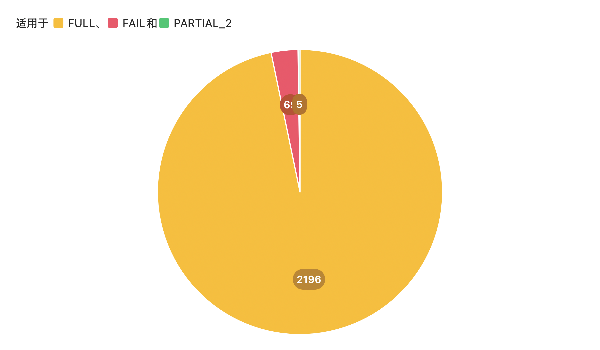
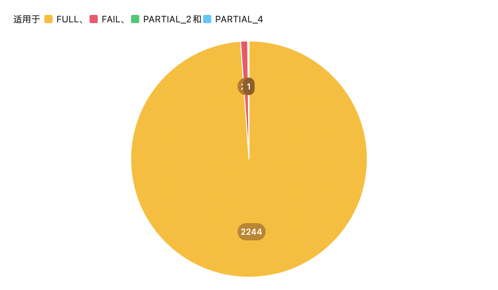

# 🧪 简单使用教程
> 首先激活该**模型**的虚拟环境：

```bash
conda activate sum_env
conda deactivate
python summarization_DS.py
```


### 激活 GLM 虚拟环境
如果使用 **GLM**，请更换为其对应的虚拟环境
```bash
source /root/DiabetesPDiagLLM/.diabetesPDiagLLMVenv/bin/activates
```

---

# 上传更新代码

```bash
git status
git add .
git commit -m "abcd"
git push origin main
```

---

# 📝 开发日志（Author: MangguoD）

## 2025/3/21 - **lv1**

- 初始版本，基本完成了数据处理工作
- 初始功能：
1. 对文本进行模版化的总结
2. 处理 think部分的输出
3. 中断保存功能，可以自由控制使用时间
4. 显存释放
- **输出可用度**：86.8%（估算）
- **速度**：499条 / 3.39小时  
- **输出图示**：


---

## 📅 2025/3/22 - **lv2**

### 更新内容

1. 增强了约束力（但可能带来副作用）  
2. 增加了输入提示模板，强化输出结构性，同时优化了处理速度（平均10s/条，未启用 retry）  
3. 删除了【眼底】与【并发症】部分的总结（多数数据中缺失）  
4. 增加了 **结构检测模块**，设定了**宽容度递减机制**，提升输出质量：

```
[INVALID OUTPUT] 第 1 次尝试：结构不足 4 段  
第 2 次尝试成功：结构至少有 3 段
```

5. 即使结构不完整也会输出并保存  
6. 错误输出会记录以供分析  
7. 自动判断是否支持 flash-attention，选择适配方式  
8. 批处理功能上线，大幅提高处理效率（前提：显存允许）

### ⏱ 性能表现

- **可用度**：约 80%  
- **速度**：1168条 / 4.68小时  
- **输出图示**：


> 📈 **分析：**  
> lv2 中不可用输出与 GLM 的 loss 曲线呈现一致性，推测原因为输入内容过长，超出模型 token 或思维能力上限。

---

## 📅 2025/3/24 - **lv2_text_cut**

### 更新内容

1. 增加文本截断机制  
   - DeepSeek-7b 最大输入 token ≈ 16000  
   - 设置截断为 8000，生成 token 为 1200，保留冗余空间  
2. 显存释放逻辑优化，更长时间运行更加稳定  
3. 默认采用 **左侧 padding**  
4. 强化提示词逻辑，确保截断不会丢失关键信息 
5. 后处理结构迭代：  
   - 自动删除 `think` 部分  
   - 自动去除输出中的 `【结构模版】` 提示语  
   - 清理常见冗余输出，进行“返厂维修”

### ⏱ 表现提升

- **准确率提升至 92.9%**，仍有优化空间  
- **输出图示：**


---

## 📅 2025/3/25 - **lv2_text_cut_b15**
**- UPDATE!**

### 更新内容

1. 改进了提示词，现在会给予模型更明确的文本结构和总结方式（虽然有的时候还是会出错）  
2. 后处理结构迭代：现在遇见模型输出的重复大段会自动清洗（可能导致正确错误输出混淆）
3. 提高batch为15

## 小介绍

1. 模型输出大段重复内容以及对提示词模板进行堆砌输出实际上是提示词`指令重复/过激/语义歧义`，所以接下来的优化主要是提示词的优化，但是人为剔出错误信息并进行再处理相对来说效率更高

### ⏱ 表现提升

- **准确率提升至 96.7%**，目前为止最好的一次
- **7.98h/2270条**
- **输出图示：**



---

## 📅 2025/3/29--4/10 - **Preparing**
**- UPDATE!**

### 更新内容

1. 优化了文件结构，为接下来的模型连接做准备  
2. 修改了所有文件的输出路径，准备了single和batch两个处理文件
3. 删掉了旧的README
4. 更改了single的代码结构，现在已经可以服务于workflow调用
5. 更改了batch的提示词，优化了部分代码，现在有更高的输出准确率和更好的显存释放效果
6. 在H20上，稳定的batch size为40

### ⏱ 表现提升

- **准确率提升至 98.9%**
- **换用H20显卡后速度提升至5h/2270条**
- **输出图示：**



## Author

[MangguoD](https://github.com/MangguoD)